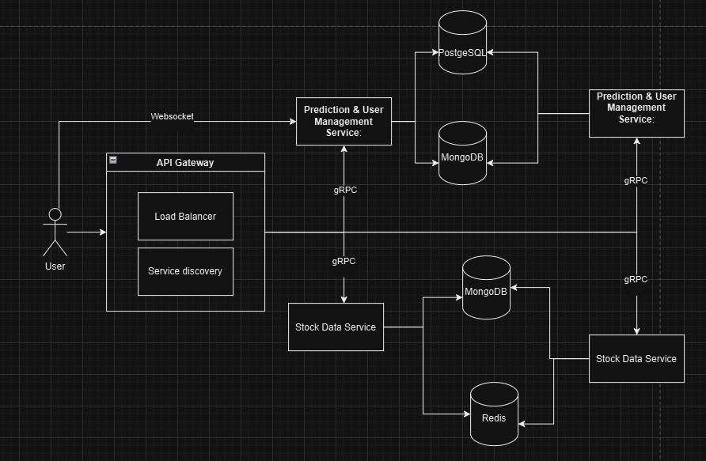

# Machine Learning Stock Price Prediction
## Application Suitability
1. **Why is this application relevant?**
* **Investment Insights:** A stock price prediction system can provide investors with insights to make more informed buy or sell decisions. By leveraging machine learning, this system can potentially increase accuracy in predicting stock trends.
* **Data-Driven Decision Making:** As financial markets fluctuate based on numerous factors, having access to historical data and predictive analysis allows users to make data-driven decisions, reducing reliance on emotional trading or speculation.

2. **Why does this application require a microservice architecture?**
* **Modularity and Maintainability:** Each component (data retrieval, prediction, and user management) can be developed and tested independently, making it easier to manage
* **Future Expandability:** It is going to be easier ater to  add more features (like additional prediction strategies) without overhauling the entire system.

Real-world examples of similar systems using microservices:

- **Robinhood**: A stock trading platform that handles real-time stock data and user management.
- **Alpaca**: A commission-free API for algorithmic trading, integrating microservices for data fetching and trade execution.
- **QuantConnect**: A cloud-based platform for algorithmic trading and backtesting, using microservices for data processing and prediction models.


## Service Boundaries


* **Stock Data Service:** Fetches historical stock data from an external API. This service is essential as it provides the raw data needed for predictions.
* **Prediction & User Management Service::**  Manages both user profiles (registration, login) via MongoDB and analyzes the fetched stock data to provide predictions (buy, sell,) using machine learning methods. 

## Technology Stack and Communication Patterns

### Technology Stack and Communication Patterns

1. **API Gateway**:
   - **Language**: Node.js
   - **Framework**: Express (RESTful API)
   - **Purpose**: Routes user requests to the Stock Data Service and Prediction Service, and handles WebSocket connections for real-time updates.

2. **Stock Data Service**:
   - **Language**: Python
   - **Framework**: Flask
   - **External API**: Alpha Vantage (for stock data)
   - **Cache**: Redis (for caching stock data)
   - **Purpose**: Purpose: Fetches and caches historical stock data, communicates with the API Gateway via gRPC.

3. **Prediction Service**:
   - **Language**: Python
   - **Framework**: Flask
   - **ML Library**: Scikit-learn (for predictions)
   - **Database**: PostgreSQL (for storing predictions)
   - **Purpose**: Purpose: Analyzes stock data, generates predictions, and sends real-time updates via gRPC to the API Gateway.

4. **WebSocket**:
   - **Technology**:  Node.js with Socket.IO (integrated into the API Gateway)
   - **Purpose**: Provides real-time updates to multiple users in dynamic rooms (based on stock symbols).


## Data Management
* **UPrediction & User Management Service:**
```
    /api/users/register - Creates a new user account.
    /api/users/login - Authenticates a user and returns a session token.
    /api/users/profile - Retrieves user profile details.
    /api/predict - Generates stock price predictions based on historical data.
    /api/users/profile/update - Updates user profile information.
```

* **Stock Data Service:**

```
    /api/stocks/history - Retrieves historical stock data for a specific stock symbol.
    /api/stocks/cache/clear - Clears the cache for stock data.

```

* **WebSocket Endpoints:**

```
    /websocket/stock/{symbol} - Subscribes users to real-time updates for a specific stock symbol.
    /websocket/stocks/all - Subscribes users to real-time updates for all stocks.
    /websocket/user/{userId}/notifications - Subscribes users to personalized notifications, such as stock alerts or account updates.


```

* **Example WebSocket Message 1: Real-time Stock Price Update**

```json
{
  "type": "stock_price_update",
  "symbol": "AAPL",
  "price": 151.75,
  "timestamp": "2024-09-21T14:23:00Z"
}


```

* **Example WebSocket Message 2: Stock Prediction Notification**

```json
{
  "type": "prediction_update",
  "symbol": "AAPL",
  "prediction": "buy",
  "timestamp": "2024-09-21T14:24:00Z"
}


```

## Prediction & User Management Service

**POST /api/users/register**

```json
{
  "name": "Jason Statham",
  "email": "jasontop123@gmail.com",
  "password": "password123"
}


```


**POST /api/users/login**

```json
{
  "email": "jasontop123@gmail.com",
  "password": "password123"
}


```
**POST /api/predict**
```json
{
  "symbol": "AAPL",
  "data": [
    { "date": "2024-09-18", "price": 150.25 },
    { "date": "2024-09-17", "price": 149.30 }
  ]
}


```
## Stock Data Service

**GET /api/stocks/history**

```json
{
  "symbol": "Apple"
}

```

**POST /api/stocks/cache/clear**

```json
{
  "symbol": "Tesla"
}

```


## Deployment and Scaling

* Containerization: Each microservice will be packaged into Docker containers for consistent deployment across various environments.
* Orchestration:Kubernetes will be used to manage the deployment, scaling, and load balancing of the containers. This ensures that the services are highly available and can scale efficiently based on demand, such as during high traffic for stock data requests or predictions.
